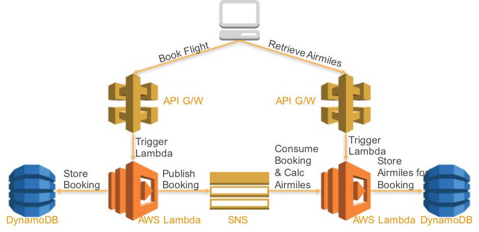

## AWS Cross Account Serverless Microservices

This repo contains a sample application composed of a web application supported by two serverless microservices. The microservices will be owned by different product teams and deployed into different accounts using AWS CodePipeline, AWS CloudFormation and the Serverless Application Model (SAM). At runtime, the microservices will communicate using an event-driven architecture which requires asynchronous, cross-account communication via an Amazon Simple Notification Service (Amazon SNS) Topic. 

## License

This library is licensed under the Apache 2.0 License. 



## Deploying the serverless microservices sample application

#### 1. Pre-requisites

You will need three or four AWS accounts. 
* a Tools account for the CodePipelines
* a Booking account for the Bookings microservice
* an Airmiles account for the Airmiles microservice
* an S3-Bucket account for the S3 website web interface. If you want to use only three accounts, you can optionally deploy this to the 
Tools account, i.e. the same account as the CodePipelines

#### 2. Clone the sample Lambda function GitHub repository

[Clone](https://help.github.com/articles/cloning-a-repository/) the [microservices sample application](https://github.com/aws-samples/aws-cross-account-serverless-microservices.git) GitHub repository.

From your terminal application, execute the following command:

```commandline
git clone https://github.com/aws-samples/aws-cross-account-serverless-microservices.git
```

This creates a directory named `aws-cross-account-serverless-microservices` under your current directory, which contains the code for the Serverless Microservices sample application.

#### 3. Prepare the bootstrap script that will execute the CloudFormation templates and create the cross stack CodePipelines

Change into the cloned directory, and edit the file single-click-cross-account-pipeline.sh

```commandline
vi single-click-cross-account-pipeline.sh
```

Change the following entries in lines 2-15, and save your changes:

```commandline
ToolsAccount = <AWS 12 digit account number for the Tools account, where the CodePipelines will be deployed>
ToolsAccountProfile = <AWS profile for the Tools account, as defined in ~/.aws/credentials>
BookingNonProdAccount = <AWS 12 digit account number for the Booking account, where the Booking microservice will be deployed>
BookingNonProdAccountProfile = <AWS profile for the Booking account, as defined in ~/.aws/credentials>
AirmilesNonProdAccount = <AWS 12 digit account number for the Airmiles account, where the Airmiles microservice will be deployed>
AirmilesNonProdAccountProfile = <AWS profile for the Airmiles account, as defined in ~/.aws/credentials>
region = <e.g. us-east-1. Must be a region where CodeCommit, CodePipeline, CodeBuild and other required services are supported)
S3WebsiteBucketName = <a global available name of a bucket for website hosting. This bucket name should not exist>
S3TmpBucketName = <name of a temporary bucket created by the installation script and used during installation. This bucket name should not exist>
```

#### 4. Execute single-click-cross-account-pipeline.sh

From your terminal application, execute the following command:

```bash
./single-click-cross-account-pipeline.sh
```

This will create stacks in all the accounts. Wait until all stacks are successfully created.

#### 5. Copy the microservice source code and push to AWS CodeCommit

In the AWS Console, in the Tools account, in the region specified in single-click-cross-account-pipeline.sh, select
the CloudFormation service and find the 'booking-pipeline' stack.

Copy the value of this stack output variable: `SourceCodeCommitCloneUrlHttp`

In a directory in your terminal application where you want to clone the application repository, execute the commands below. 
Note that this clones an empty GIT repo for the Booking microservice, into which you'll copy the Booking source code from 
the aws-cross-account-serverless-microservices.git repo (you may have to adjust the cp -R statement below if you use a different directory structure):

```bash
git clone <value of the SourceCodeCommitCloneUrlHttp stack output variable>
cp -R aws-cross-account-serverless-microservices/Booking/* <cloned repo directory>/   ### note that 'cp' works differently on Mac and Linux, as well as in some shells. In Linux you may have to use cp -R aws-cross-account-serverless-microservices/Booking/* <cloned repo directory>/
cd <cloned repo directory>
git remote -v
git add .
git commit -m 'new'
git push
```

It's quite important to use the 'cp' command as specified above, to make sure you do not overwrite the .git directory that will already
exist in the directory you cloned into. Check the output of the `git remote -v` command to ensure that Git is pointing
to the correct repository. If your `cp` command overwrote the .git directory, you may see the original repo here, which is incorrect.

This will push the source code for the Booking microservice to CodeCommit, and trigger the booking CodePipeline. You can
find the CodePipeline in the AWS console by clicking the value of the PipelineUrl stack output variable in the 'booking-pipeline' stack

#### 6. Monitor deployment of the Booking microservice

In the AWS Console, in the Tools account, monitor the progress of the 'booking-pipeline' CodePipeline. Once the pipeline reaches the
DeployToTest stage, you can login to the Booking account in the AWS Console and view the status of the CloudFormation
deployment.

#### 7. Repeat steps 5 & 6 for the Airmiles microservice

Wait until the Booking CodePipeline is complete - you need to do this because the Airmiles service will lookup the 
Booking CloudFormation stack during deployment. Repeat steps 5 & 6 for the Airmiles microservice, using the stack
output values from the 'airmiles-pipeline' stack. Change the folder in the 'cp' statement from Booking to Airmiles.

#### 8. Confirm the API endpoints for Booking & Airmiles

Once the Booking and Airmiles CodePipelines are fully complete, you can check that the associated Lambda functions
are working correctly.

Using the stack output values from booking-lambda and airmiles-lambda (in the booking and airmiles accounts), get
the value of the API endpoints (BookingAPI and AirmileAPI). A script is provided that will print these out for you.
Execute `get-api-endpoints.sh` (which you can find in the aws-cross-account-serverless-microservices repo) after 
updating the parameter values in the script, and ensuring the region parameter matches the region where you have 
created the CloudFormation stacks.

Replace the Booking API Gateway endpoint in the 'curl' statement below, and check that you can POST a request to the API.
Make sure the suffix, /Prod/bookings, still appears in the URL after you replace the API endpoint:

```bash
curl -H "Content-Type: application/json" -X POST -d '{"first_name":"Michael","last_name":"Surgeon","from_airport":"DEL","to_airport":"MEL","booking_class":"Economy","departure_date":"12/04/2017","return_date":"21/04/2017","age_group":"Adult"}' https://lv71x6qei8.execute-api.us-east-1.amazonaws.com/Prod/bookings
```

this should return a booking_number, such as "7NIXnSSI". You can follow this up with a GET on the API endpoint, e.g.:

```bash
curl https://lv71x6qei8.execute-api.us-east-1.amazonaws.com/Prod/bookings
```

after posting to bookings, the booking information should flow via SNS to airmiles, so check the airmiles endpoint 
for the booking_number (after replacing the Airmiles API Gateway endpoint, and ensuring /Prod/airmiles still appears in the URL):

```bash
curl https://4oiogvmtpa.execute-api.us-east-1.amazonaws.com/Prod/airmiles/7NIXnSSI
```

#### 9. Create S3 Website web interface

You'll need the Booking and Airmiles API endpoints for this step, so complete step 8 before moving on.

The WebUI website is hosted in S3. In the AWS Console, in the Tools account, in the region specified in 
single-click-cross-account-pipeline.sh, select the CloudFormation service and find the 'webui-pipeline' stack.

Copy the value of this stack output variable: `SourceCodeCommitCloneUrlHttp`

In a directory in your terminal application where you want to clone the application repository, execute the commands below. 
Note that this clones an empty GIT repo for the Web interface, into which you'll copy the WebUI source code from 
the aws-cross-account-serverless-microservices.git repo (you may have to adjust the cp -R statement below if you use a different directory structure):

```bash
git clone <value of the SourceCodeCommitCloneUrlHttp stack output variable>
cp -R aws-cross-account-serverless-microservices/WebUI/* <cloned repo directory>/   ### note that 'cp' works differently on Mac and Linux. In Linux you may have to use cp -R aws-cross-account-serverless-microservices/Booking/* <cloned repo directory>/
cp -av aws-cross-account-serverless-microservices/WebUI/.babelrc <cloned repo directory>/
cd <cloned repo directory>
```

Before pushing the website code to the CodeCommit repo we need to update the API endpoints to ensure the WebUI points
to the Booking and Airmiles microservice endpoints. This can be done manually, or you can use the script provided 
for you. In both cases you need to be in the cloned WebUI repo directory.

If you are using the script, update the parameter values in the script `update-webui-config.sh`, then do the following:

```bash
./update-webui-config.sh
git add .
git commit -m 'new'
git push
```

If you want to update the WebUI config manually, do the following:
* Note down both the Booking and Airmiles API endpoints from step 8 above. 
* For example, the Booking API endpoint would look something like this: `https://lv71x6qei8.execute-api.us-east-1.amazonaws.com`.
* Replace the placeholders in the bash script below with the actual API endpoints. For example, replace `<the-booking-api-endpoint>`
with `https://lv71x6qei8.execute-api.us-east-1.amazonaws.com` 
* Run the shell commands below

```bash
cp src/widgets/axios.js.template src/widgets/axios.js
sed -i -e "s%BOOKING_URL%<the-booking-api-endpoint>%" src/widgets/axios.js
sed -i -e "s%AIRMILES_URL%<the-airmile-api-endpoint>%" src/widgets/axios.js
git add .
git commit -m 'new'
git push
```

Check the status of the WebUI CodePipeline. You can find the CodePipeline in the AWS console by clicking the value of 
the PipelineUrl stack output variable in the 'webui-pipeline' stack. Wait until the WebUI CodePipeline is complete, 
login to the Web Interface account in the AWS Console, and find the WebURL output value from the 'webui-s3-website-bucket' 
stack, which contains the URL to access the serverless web interface. Open the WebUI in a browser. 

After booking a flight you should see the flight booking and the associated airmiles in a list at the bottom of the 
page (you may need to scroll the web page). 

Your flight booking was sent to the Booking microservice, which stored the booking and published an event to SNS. 
The airmiles microservice consumed the flight booking event and calculated the airmiles (just a random calculation, 
no intelligence), stored the airmiles in DynamoDB.  The web application queries both APIs to populate the list of 
flight bookings. The web application, booking and airmiles services all run in separate AWS accounts.

### Cleanup
Run the script below to remove all the stacks and associated AWS resources. I do attempt to delete the S3 buckets, though
cleanup may fail if the S3 buckets can't be emptied. If necessary, you can easily empty the bucket referenced by the 
`S3WebsiteBucketName` parameter in the AWS Console:

```
$ ./single-click-cleanup.sh 
```

### Troubleshooting

#### CLI version issue
If you receive an error, such as the one below, while running single-click-cross-account-pipeline.sh,  
it could be related to the version of awscli you are using. For instance, I received the error below:

```
$ ./single-click-cross-account-pipeline.sh 
creating pre-reqs stack for booking

'list' object has no attribute 'split'
```

when using this version of the awscli:

```
$ aws --version
aws-cli/1.11.44 Python/2.7.12 Linux/4.9.38-16.35.amzn1.x86_64 botocore/1.5.7
```

After upgrading awscli to the latest version, the issue was resolved:

```
$ aws --version
aws-cli/1.11.142 Python/2.7.12 Linux/4.9.38-16.35.amzn1.x86_64 botocore/1.7.0
```

### Useful references
* [code-commit-url](https://aws.amazon.com/devops/continuous-delivery/)
* [code-build-url](https://aws.amazon.com/codebuild/)
* [code-pipeline-url](https://aws.amazon.com/codepipeline/)
* [clouformation-url](https://aws.amazon.com/cloudformation/)
* [lambda-url](https://aws.amazon.com/lambda/)
